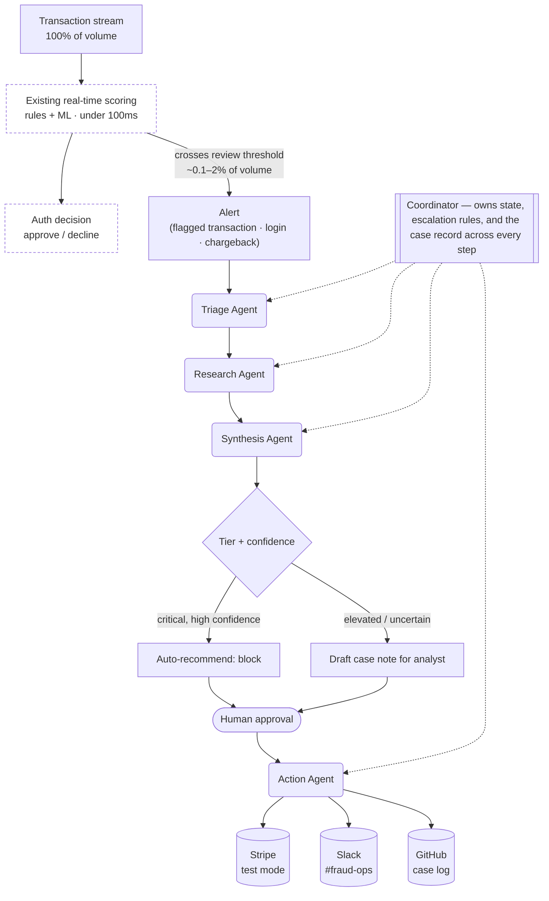

# Casework

A multi-agent fraud-signal triage system: five coordinated agents that pick up where a bank's existing real-time fraud-scoring layer leaves off, research an already-flagged alert, draft a recommendation, and — only with a human in the loop — act on it against real payments infrastructure.

See `casework-spec.md` for the full design.

Stack: Claude Agent SDK + MCP · Stripe test mode (PaymentIntents) · FastAPI (Python) · SQLAlchemy · Postgres · React + Vite + TypeScript.

## Why I built this

> At Capital One, a Rules-as-a-Service platform I led cut rule-change cycle time from a month to hours using ML classification — and saved $4M a year. I also personally identified a novel fraud ring and helped stop it inside a week. Casework is what an agentic version of that workflow looks like: classification, research, and prioritization handled by coordinated agents, with a human still making every call that matters.

Casework is deliberately scoped to sit downstream of the real-time authorization decision — in the investigation queue a fraud-ops analyst already works today, not in the sub-100ms path that decides whether a swipe is approved. A bank can't afford to run every transaction through an LLM, and doesn't need to: the existing real-time scoring layer (rules plus a lightweight ML model) already makes that call on 100% of volume. Casework only picks up what that layer flags — roughly 0.1–2% of transactions — which is exactly the scale a few seconds of agent reasoning per case can afford.

## Architecture



*The dashed boxes already exist in the customer's stack — Casework is never in that path. The coordinator is the only thing that talks to every agent below the alert queue; individual agents never call each other directly, which keeps each handoff's contract enforceable at that boundary.*

| Agent | Input → Output | Job |
|---|---|---|
| **Coordinator** | `Signal` + prior case history → routed case (`auto_escalated` / `pending_review` / `closed`) | Owns the case end to end: invokes agents in order, applies the deterministic escalation rule, persists state |
| **Triage** | `Signal` → `TriageResult` (pattern, tier, confidence, entities) | Classifies the alert into a fraud pattern from the transaction's own fields plus short-term velocity — no tools, no database access. This is the cheap gate: a low-confidence/benign result closes the case immediately with no further agent calls |
| **Research** | `TriageResult` → `ResearchBrief` (matched rules, similar cases, evidence) | The only agent with database access (read-only Postgres MCP) — turns a classification into real evidence: which written rule matches, which prior cases for this account or pattern actually exist |
| **Synthesis** | `TriageResult` + `ResearchBrief` → `CaseRecommendation` (risk score, action, draft note) | Turns classification + evidence into a risk score and a drafted note a human can act on in seconds |
| **Action** | Approved `CaseRecommendation` → `ActionResult` | Executes against real systems (Slack, GitHub) only after a human clicks approve or deny. Capturing or cancelling the held Stripe PaymentIntent is a deterministic decision made in code, never something an LLM decides |

Every handoff between agents is a validated Pydantic model, never raw text — the detail that separates this from a prompt-chaining demo. Escalation itself is plain deterministic Python (`decide_route()`), not an LLM call: gating an auto-block on the model's own self-reported urgency would be exactly the kind of over-trust the Action Agent's design deliberately avoids.

## Real systems, not mocks

Every integration below is live, test-mode Stripe/Slack/GitHub, not simulated:

| System | Used by | What it's for |
|---|---|---|
| **Stripe** (test mode, PaymentIntents) | Checkout, Action Agent | Authorize a PaymentIntent with manual capture and read back Radar's real `risk_level`; capture it once the pipeline clears the transaction, cancel it if a human (or the deterministic route) rejects it. The whole pipeline runs *before* any money moves, so there's never a completed charge to refund |
| **Slack** (#fraud-ops) | Action Agent | Post case summaries, escalations, and the human-approval prompt |
| **GitHub Issues** (public demo repo) | Action Agent | Stand-in case-management system — one issue per case, labeled by tier |
| **Postgres** (rules + case history) | Research Agent | Query matched rules and similar past cases for context |

## Running it locally

Everything below runs the actual deployable artifacts (the same Dockerfiles Cloud Run will use) via `docker-compose` — no local Python/Node install needed, only Docker.

**1. Prerequisites** — Docker Desktop (or Engine + Compose), and real credentials for:

| Credential | Where to get it |
|---|---|
| `ANTHROPIC_API_KEY` | console.claude.com → API keys |
| `STRIPE_SECRET_KEY` | dashboard.stripe.com, toggled to **test mode** |
| `SLACK_BOT_TOKEN` + `SLACK_TEAM_ID` | api.slack.com/apps — a bot with `chat:write` and `channels:read` scopes, installed to your workspace |
| `GITHUB_PAT` + `GITHUB_DEMO_REPO` | a fine-grained PAT scoped to `issues:write` on a repo you control |

**2. Configure environment files:**

```bash
cp backend/.env.example backend/.env    # fill in the real credentials above
cp frontend/.env.example frontend/.env  # defaults are already correct for local
```

**3. Start everything:**

```bash
docker compose up -d --build
```

This builds and starts four containers: `db` (Postgres, host port 5434), `db_test` (a second disposable Postgres for the test suite, port 5433), `backend` (FastAPI + real Claude Agent SDK agents, port 8000), and `frontend` (Vite dev server, port 5173). `docker compose logs -f backend` shows each agent call as it happens — useful for watching a real Triage → Research → Synthesis run live.

**4. Seed demo data** (personas + rules + a couple of pre-cleared cases, so the Research Agent has real history to find — see `scripts/seed_dev_data.py`):

```bash
docker compose exec backend uv run python scripts/seed_dev_data.py
```

**5. Try it**: open `http://localhost:5173`, submit a checkout with any of the three Stripe test cards, and watch the case either auto-close or land in the fraud-ops queue (`http://localhost:5173/queue`) with a real drafted note, ready to approve or deny.

**6. Run the checks:**

```bash
docker compose exec backend uv run pytest tests/unit tests/integration
docker compose exec backend uv run ruff check app tests scripts
docker compose exec backend uv run mypy app tests scripts
docker compose exec frontend npm run test
```

**7. Run the eval harness** (real Claude API calls — the full 20-scenario run costs real time and money; `--only` re-runs a single scenario cheaply while iterating on a prompt):

```bash
docker compose exec backend uv run python scripts/run_eval.py
docker compose exec backend uv run python scripts/run_eval.py --only card_testing_01
```

**Tear down** with `docker compose down` (add `-v` only if you also want to wipe the seeded database volume — without `-v`, your data survives a restart).

## Backend architecture

The backend follows a domain-driven, dependency-inverted layout:

- `domain/entities/` — Pydantic domain objects (the base DTOs that flow router → service → repository)
- `domain/repositories/`, `domain/agents/`, `domain/gateways/` — `Protocol` ports; domain services depend on these abstractions, never on a concrete implementation
- `domain/services/` — orchestration and business logic (`CoordinatorService` owns the deterministic escalation rules; `CasesService` owns the capture-vs-cancel decision on approve/deny)
- `infrastructure/db/`, `infrastructure/repositories/`, `infrastructure/agents/`, `infrastructure/payments/` — concrete SQLAlchemy, real Claude Agent SDK + MCP agent adapters, and the Stripe gateway implementing those ports (plus deterministic stub adapters used in tests and the eval harness)
- `api/` — FastAPI routes and the composition root (`api/dependencies.py`) that wires concrete adapters to the ports routes and services depend on

## Database schema

`db/schema.sql` is hand-written DDL and is the source of truth for the database schema — it's applied directly via `docker-compose`'s init scripts, in CI, and by `scripts/init_db.sh`. The SQLAlchemy models under `backend/app/infrastructure/db/models/` are a query/persistence layer over that schema, not a migration tool, so the two are kept in sync by hand.

That's a deliberate simplification for a project this size (5 tables, changing rarely). **In production, use Alembic** to autogenerate migrations from the SQLAlchemy models instead, so the models become the single source of truth and versioned migration scripts take over `schema.sql`'s job.

## Eval results

`eval_report.md` — generated by `backend/scripts/run_eval.py` against 20 hand-labeled scenarios (`backend/scripts/eval_scenarios.yaml`, matching the exact split in `casework-spec.md` §10), run through the real Triage/Research/Synthesis agents end to end:

| Metric | Result |
|---|---|
| Pattern classification accuracy | 100% (20/20) |
| Route/tier-escalation correctness | 100% (20/20) |
| False-positive rate on the benign set | 0% (0/2) |
| Time-to-draft-recommendation (elevated/critical scenarios) | mean 23.5s, median 20.0s |

Worth being honest about, per the eval run itself: a few drafted case notes state specific corroborating details (e.g. an exact device count) that aren't actually present in the underlying evidence — the classification and routing were correct, but the drafted note occasionally overclaims specificity it doesn't have. That's a real prompt-quality finding the eval harness surfaced, not something papered over here.

## The three Stripe test-card paths

Verified against the current PaymentIntent-based checkout flow, with this account's Stripe Radar risk controls (Settings → Radar → Risk controls, test mode) disabled:

| Test card | `risk_level` | What actually happens |
|---|---|---|
| `4000000000009235` (elevated) | elevated | Authorizes successfully, Signal created, full pipeline runs, case lands in the queue as `pending_review` |
| `4000000000004954` (highest, not auto-blocked) | highest | Authorizes successfully, Signal created, Triage/Research/Synthesis run against a real `highest`-risk reading from Stripe |
| `4100000000000019` (highest, always blocked) | highest | Also authorizes successfully in this configuration — see caveat below |

Stripe's own docs describe `4100000000000019` as "always blocked regardless of your rules," but that stopped holding once every Radar risk control on this account was disabled — with everything off, none of the three test cards get blocked at the Stripe level, including that one. This account currently has (at least) three independent Radar mechanisms that can each block a payment on their own — a classic `risk_level` rule, the "Early fraud warning" risk control, and the "Fraudulent card payments" risk control — and getting the always-blocked card to reliably decline while the not-auto-blocked card reliably authorizes would mean threading a needle between two risk scores (77 and 81–88 in testing) that are close enough not to trust a single threshold between them.

Taking the trade rather than chasing that: with risk controls off, all three cards now authorize and flow into the real agent pipeline instead of two of three — more live, agent-graded outcomes to show, at the cost of the one card no longer demonstrating "Stripe blocks it before Casework ever sees it" live. That code path (`AuthorizationDeclinedError`, never creating a Signal for a declined authorization) is still real and still covered by the unit and integration test suites — it's just not the specific test card currently triggering it in this Stripe test-mode account.

## Verifying the checkout flow

```bash
cd backend && uv run python -c "
import asyncio
from app.config import get_settings
from app.domain.entities import CaseSource
from app.domain.services import CheckoutService, CoordinatorService
from app.infrastructure.agents import ClaudeResearchAgent, ClaudeSynthesisAgent, ClaudeTriageAgent, StubActionAgent
from app.infrastructure.db.session import close_engine, get_sessionmaker, open_engine
from app.infrastructure.payments.stripe_gateway import StripePaymentGateway
from app.infrastructure.repositories import SqlAlchemyCaseEventsRepository, SqlAlchemyCasesRepository, SqlAlchemySignalsLogRepository

async def main():
    await open_engine()
    async with get_sessionmaker()() as session:
        cases_repo = SqlAlchemyCasesRepository(session)
        coordinator = CoordinatorService(
            cases_repo, SqlAlchemyCaseEventsRepository(session), SqlAlchemySignalsLogRepository(session),
            ClaudeTriageAgent(), ClaudeResearchAgent(get_settings()), ClaudeSynthesisAgent(), StubActionAgent(),
        )
        checkout = CheckoutService(coordinator, StripePaymentGateway(get_settings()), source=CaseSource.INTEGRATION_TEST)
        result = await checkout.checkout(
            account_id='acct_verify', amount=42.50, merchant_id='merch_verify',
            device_context='new_device', geo_context='new_or_foreign_location',
            recent_password_reset=True, mfa_completed=False, failed_logins_this_session=2,
            test_card='elevated',  # or highest_not_blocked / highest_blocked
        )
        print(result.risk_level, result.case.status if result.case else result.pipeline_error)
        await cases_repo.delete_by_source('integration_test')  # cleanup
    await close_engine()

asyncio.run(main())
"
```

## Live demo

Not recorded yet — pending GCP/Cloud Run deployment (next up). This section will carry the deployed URL and a 90–120s walkthrough once that's live: submitting the elevated card and watching the case land in the queue, approving it and cutting to the real Slack/GitHub posts, and submitting the highest-risk card to show it auto-escalate straight to a gated block recommendation. (The original plan also called for showing the always-blocked card fail instantly at checkout — per the caveat above, that's not currently reproducible with this account's Radar configuration, so the recording won't include it.)

## What I'd build next

A few things I'd do differently for a real customer, all surfaced by actually building this rather than guessed upfront:

- **A retry/reconciliation queue instead of a synchronous in-process pipeline call.** `CheckoutService` currently calls the Coordinator directly from the checkout request; if the pipeline fails after a PaymentIntent is authorized, that authorization is left held with no case to resolve it. A real system would decouple the two with a queue and a reconciliation job, not rely on a human noticing a dangling authorization.
- **A restricted Stripe API key**, scoped to exactly what this system is allowed to do to real money (create/capture/cancel PaymentIntents, read Radar outcomes) — not the full test secret key used here for convenience.
- **Extend the tool-call verification pattern already built for the Action Agent.** After discovering an agent could report a fabricated "success" when its Slack tool call silently failed to fire, I added verification that requires an actual successful tool call before trusting a freeform agent's self-reported outcome (`AgentActionError` in `base.py`). The same discipline is worth extending to Research's tool use, not just Action's.
- **A real synthetic bulk-volume engine** (spec §6's toy logistic-regression + rules layer) to generate realistic flag-rate volume calibrated against a public reference dataset — scoped out of this build in favor of the live Stripe Radar demo path and the hand-labeled eval set, but a real deployment needs both: synthetic volume to prove the system holds up at scale, not just on 20 hand-picked cases.
- **Finish the GCP deployment pipeline** — Workload Identity Federation, Cloud SQL, and the two Cloud Run services are designed but not yet live.
