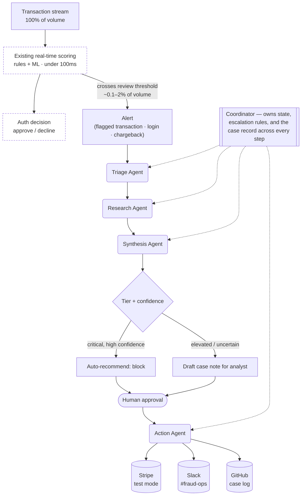

# Casework — Build Spec

**Project spec — weekend build, for a Forward Deployed Engineer portfolio**

A multi-agent fraud-signal triage system: five coordinated agents that pick up where a bank's existing real-time fraud-scoring layer leaves off, researching an already-flagged alert, drafting a recommendation, and — only with a human in the loop — acting on it against real payments infrastructure.

Stack: Claude Agent SDK + MCP · Stripe test mode · Python · Postgres

---

## 1. Why this project

A forward deployed engineer doesn't get to pick a clean domain — they sit inside a customer's real stack and ship something that removes real toil, fast. Casework is built to demonstrate exactly that skill, using a domain I actually know: fraud and risk operations in payments. It's deliberately scoped to sit downstream of the real-time authorization decision, in the investigation queue an analyst already works today — not in the sub-100ms path that decides whether a swipe is approved.

> At Capital One, a Rules-as-a-Service platform I led cut rule-change cycle time from a month to hours using ML classification — and saved $4M a year. I also personally identified a novel fraud ring and helped stop it inside a week. Casework is what an agentic version of that workflow looks like: classification, research, and prioritization handled by coordinated agents, with a human still making every call that matters.
>
> — framing for the project README

## 2. System at a glance

Casework never sees raw transaction volume — a bank can't afford to run every swipe through an LLM, and doesn't need to. The existing real-time scoring layer (rules plus a lightweight ML model, under 100ms, running on 100% of transactions) already makes the approve/decline call. Casework picks up only what that layer flags: the alert queue a human analyst would otherwise work by hand.

| Path | Runs on | Latency budget | Owner |
|---|---|---|---|
| Real-time authorization | 100% of transactions | < 100ms | Existing rules engine + scoring model — out of scope, untouched |
| Investigation queue | ~0.1–2% flagged | seconds to minutes | **Casework** — this project |

At 1M transactions a day, a 0.3% flag rate is roughly 3,000 cases — the same order of magnitude a human fraud-ops team reviews today, and comfortably affordable for a few seconds of agent reasoning per case. From there: one coordinator, four specialist agents, and three real external systems. Every agent hands off a validated, typed object — never raw text — and nothing with a real-world side effect fires without explicit approval.



*The dashed boxes already exist in the customer's stack — Casework is never in that path. The coordinator is the only thing that talks to every agent below the alert queue; individual agents never call each other directly, which keeps the handoff contracts enforceable at each boundary.*

## 3. The five agents

Each agent has one job, a typed input, and a typed output. The "callback" is the real work each one is modeled on — worth saying out loud in an interview.

### 00 — Coordinator
- **Role:** Owns the case end to end: invokes agents in order, applies escalation rules, persists state across the pipeline.
- **Input:** `Signal` (an alert already flagged by the existing scoring layer) + prior case history
- **Output:** Routed case with final status: `auto_escalated` / `pending_review` / `closed`
- **Callback:** The judgment calls behind Capital One's short-term prioritization program — deciding what gets escalated now versus queued.

### 01 — Triage Agent
- **Role:** Classifies the already-flagged alert into a fraud pattern and assigns a risk tier — refining, not replacing, the score that got it here.
- **Input:** `Signal`
- **Output:** `TriageResult` — pattern, tier, confidence, extracted entities
- **Callback:** The classification layer behind the Rules-as-a-Service platform that cut rule-change cycle time from a month to hours.

### 02 — Research Agent
- **Role:** Pulls context via MCP: matching rules from the rules table, similar past cases, supporting evidence.
- **Input:** `TriageResult`
- **Output:** `ResearchBrief` — matched rules, similar cases, evidence
- **Callback:** The rules corpus from the Capital One platform, plus Splunk-style log lookups from IBM Security.

### 03 — Synthesis Agent
- **Role:** Produces a risk score, a recommended action, and a drafted case note for a human reviewer.
- **Input:** `TriageResult` + `ResearchBrief`
- **Output:** `CaseRecommendation` — risk score, action, draft note, approval flag
- **Callback:** The prioritization work that saved $3M a year by routing the right claims to the right reviewers first.

### 04 — Action Agent
- **Role:** Executes the *approved* action against real systems. Never fires without a human decision in the loop.
- **Input:** Approved `CaseRecommendation`
- **Output:** `ActionResult` — what happened, who approved it, when
- **Callback:** The argument for eventual consistency over "minor risk management concerns" — a design philosophy about not over-trusting automation with irreversible actions.

## 4. Handoff schemas

Every handoff is a validated Pydantic model, not a string — this is the detail that separates a production agent system from a prompt-chaining demo. Note that `Signal` carries the upstream score and rule that triggered it: Casework inherits context from the existing scoring layer, it doesn't re-derive it.

```python
class Signal(BaseModel):
    signal_id: str
    signal_type: Literal["transaction", "login", "chargeback"]
    occurred_at: datetime
    account_id: str
    upstream_score: float  # score from the existing real-time engine that flagged this
    flag_reason: str       # e.g. "velocity_rule_7", "ml_score_0.92"
    payload: dict  # amount, merchant_id, device_context, geo_context, session_flags

class TriageResult(BaseModel):
    signal_id: str
    pattern: Literal["card_testing", "account_takeover", "merchant_fraud",
                     "mule_activity", "friendly_fraud", "benign"]
    tier: Literal["low", "elevated", "critical"]
    confidence: float
    entities: dict

class ResearchBrief(BaseModel):
    signal_id: str
    matched_rules: list[str]
    similar_cases: list[str]
    evidence: list[str]

class CaseRecommendation(BaseModel):
    signal_id: str
    risk_score: float
    recommended_action: Literal["block", "flag_for_review", "monitor", "clear"]
    draft_note: str
    requires_human_approval: bool

class ActionResult(BaseModel):
    signal_id: str
    action_taken: str
    executed_by: str
    approved_by: str
    timestamp: datetime
```

## 5. Real systems, not mocks (MCP integrations)

The single highest-leverage decision in this build: every integration below is live, not simulated. Anyone reviewing the repo can watch a real Stripe test-mode flag, a real Slack post, a real GitHub issue.

| System | Used by | What it's for |
|---|---|---|
| **Stripe** (test mode) | Action Agent | Flag or block a charge, add a customer to a radar-style watch list |
| **Slack** (#fraud-ops) | Action Agent | Post case summaries, escalations, and the human-approval prompt |
| **GitHub Issues** (public demo repo) | Action Agent | Stand-in case management system — one issue per case, labeled by tier |
| **Postgres** (rules + case history) | Research Agent | Query matched rules and similar past cases for context |

## 6. Simulating an alert

No production payment system, no problem — Casework needs two things to look real, and neither requires one. Most of the volume comes from a synthetic engine you write yourself; a handful of demo cases come from Stripe's own Radar, running for real, in test mode.

**Bulk volume — a toy upstream engine.** Write the "existing" real-time layer yourself, deliberately small: a handful of hand-written velocity/threshold rules — this is the part of the job you already know cold — plus a lightweight classifier (logistic regression is plenty) trained on labeled synthetic transactions. Combine them into a single `upstream_score`, threshold around the top 0.3–1%, and that threshold crossing is what creates a `Signal`. To keep the flag rate honest rather than guessed, calibrate it against a real public reference point: the ULB *Credit Card Fraud Detection* dataset (284,807 anonymized European transactions, September 2013) has an actual fraud rate of about 0.17% — a useful sanity check for what "realistic" looks like, even though your own transactions are synthetic.

**Demo credibility — Stripe Radar, test mode.** For the handful of cases in the demo video, don't simulate the score at all — Stripe's own Radar engine runs on every test-mode charge and returns a real risk level. Create charges with these documented test card numbers and read the actual `outcome.risk_level` back onto the `Signal`.

| Test card | Token / PaymentMethod | `risk_level` | Behavior |
|---|---|---|---|
| `4000000000004954` | `tok_riskLevelHighest` | highest | Flagged, but only blocked if your own rules say so |
| `4100000000000019` | `tok_chargeDeclinedFraudulent` | highest | Always blocked by Stripe, regardless of your rules |
| `4000000000009235` | `tok_riskLevelElevated` | elevated | Flagged for review |

*Source: Stripe's own testing documentation, docs.stripe.com/radar/testing.*

Label this split explicitly in the README — most of the dataset runs through your synthetic engine, three or four demo cases run through genuine Stripe Radar output. Stating that plainly, rather than blurring it, is itself a point in your favor: it shows you're not overclaiming what's real.

## 7. End-to-end demo flow

The whole thing is one backend process for the weekend build — no queue, no separate services. The frontend has exactly two views: a checkout page and a fraud-ops review queue.

| Endpoint | Called by | Does |
|---|---|---|
| `POST /checkout` | Checkout view | Creates a Stripe test-mode charge with the selected test card; reads back `outcome.risk_level` |
| `GET /cases?status=pending_review` | Fraud-ops queue view (polls every ~2s) | Lists cases awaiting human approval, with the drafted note |
| `POST /cases/{id}/approve` | Fraud-ops queue view | Runs the Action Agent: Slack post, GitHub case, and a Stripe refund if the recommendation was "block" |
| `POST /cases/{id}/deny` | Fraud-ops queue view | Closes the case with no action; logged as case history |

What happens, in order, when you submit the "elevated" test card:

1. **Stripe scores it.** Stripe's own Radar returns `risk_level: "elevated"` synchronously — the charge succeeds, nothing is blocked yet.
2. **Backend builds a Signal.** Maps `risk_level` to `upstream_score`/`flag_reason` and calls the Coordinator in-process — no queue needed at this scale.
3. **Triage → Research → Synthesis run.** Tier comes back `elevated`, so the full pipeline runs: pattern classification, matched rules and similar cases, a risk score and a drafted case note.
4. **The case lands in the queue.** Stored with `status: pending_review`. The fraud-ops queue view picks it up on its next poll, drafted note and all — the moment your demo video cuts to that tab.
5. **You approve it.** One click. The Action Agent fires: a real message lands in #fraud-ops, a real GitHub issue gets filed. If the recommendation was "block," it also issues a Stripe refund on that test charge — since the authorization already happened, "block" means acting on it after the fact, not stopping the swipe.

Run all three test cards and you get three different, honest stories:

| Test card | What actually happens |
|---|---|
| `4000000000009235` (elevated) | Charge succeeds, Signal created, full pipeline + human review — the primary demo case |
| `4000000000004954` (highest, not auto-blocked) | Charge succeeds but tier maps to `critical` — the Coordinator skips the draft step and auto-recommends block, still gated on one approval click |
| `4100000000000019` (highest, always blocked) | Stripe blocks it before your backend ever creates a Signal — worth showing on camera precisely because Casework never sees it. That's the architecture boundary, made visible. |

What to actually record:

- [ ] Two tabs side by side: checkout on the left, fraud-ops queue on the right
- [ ] Submit the elevated card, narrate the agent trace, watch the case appear in the queue
- [ ] Approve it, cut to Slack and GitHub showing the real post and issue landing
- [ ] Submit the highest / not-blocked card, show it skip straight to an auto-recommended block, still gated on your approval
- [ ] Submit the always-blocked card, show it fail instantly at checkout, never reaching your agents at all

## 8. What the front end actually collects

Beyond the fields Stripe needs to run a charge, the front end needs to hand the agents enough context to do more than guess. For a demo, a persona and scenario picker beats freeform fields — it keeps every run deterministic and repeatable on camera.

| Field | Captured how | Used by | Why |
|---|---|---|---|
| `account_id` | Persona picker — a handful of seeded synthetic customers, reused across runs | Research, Synthesis | Join key for "have we seen this account before" and tenure/value context |
| `amount` | Checkout field | Triage, Synthesis | Unusual amount for the claimed pattern (card testing = many small amounts) |
| `merchant_id` / category | Checkout field, or fixed per demo | Triage, Research | Merchant-fraud pattern; merchant-level chargeback history lookup |
| `device_context` | Dropdown: known device / new device | Triage, Research | The core account-takeover signal; device history lookup |
| `geo_context` | Dropdown: usual location / new or foreign location | Triage, Research | Account-takeover and mule-activity signals; geo history lookup |
| `session_flags` | Checkboxes: recent password reset, MFA completed, failed logins this session | Triage, Synthesis | Distinguishes account takeover from a normal login |
| `upstream_score`, `flag_reason` | Not collected — read from Stripe's `outcome.risk_level` after the charge | Triage | The score that got this transaction flagged in the first place |
| velocity counts | Not collected — backend queries its own recent-signal log by `account_id`/`device_context` | Triage | Card testing and mule activity are defined by rate, not any single transaction |
| tenure, lifetime volume, prior cases | Attached to the persona, seeded ahead of time, not typed at checkout | Research, Synthesis | Gives Research something real to find, and lets Synthesis weigh a long-tenured customer differently |

Seed three or four personas before you record anything: a long-tenured low-risk customer, a brand-new account, and one or two with a thin history of prior flagged-but-cleared cases. Reusing the same `account_id`/`device_context` pairing across your synthetic dataset and your live demo is what lets the Research Agent actually retrieve something instead of returning an empty brief on camera.

## 9. Escalation rules

The tier the Triage Agent assigns determines how much of the pipeline runs before a human sees the case.

| Tier | Condition | Behavior |
|---|---|---|
| critical | confidence > 0.85, pattern ∈ {card_testing, account_takeover} | Skip to auto-recommend block; notify #fraud-ops immediately. Still requires one-click human approval before the Stripe action fires. |
| elevated | everything else with signal | Full pipeline runs; drafted case note queued for analyst review. |
| low / benign | no matched pattern, or confidence < 0.4 | Logged only. No action. Added to case history as future research context. |

## 10. Synthetic dataset & eval harness

Twenty synthetic scenarios, weighted toward the patterns above, plus two that are deliberately benign — because false-positive discipline was as much the job at Capital One as catching real fraud.

| Scenario set | Count | Purpose |
|---|---|---|
| Card testing | 5 | Rapid small-value auth attempts across a card range |
| Account takeover | 4 | New device + password reset + high-value transaction within minutes |
| Merchant fraud | 3 | Chargeback rate spike concentrated at one merchant |
| Mule activity | 3 | Rapid in-and-out transfers across newly linked accounts |
| Friendly fraud / disputes | 3 | Chargeback with prior legitimate purchase history |
| Benign edge cases | 2 | Travel-triggered anomaly, legitimate high-value gift purchase |

Score against a hand-labeled ground truth for each scenario: **pattern classification accuracy**, **tier-escalation correctness**, **false-positive rate** on the benign set, and **time-to-draft-recommendation**. Check `eval_report.md` into the repo — a project with a numbers-backed value story is the whole point of an FDE portfolio.

## 11. Stretch goal — rule drafting

If time allows: when the Research Agent sees three or more signals in a rolling window share an unmatched pattern, the Synthesis Agent drafts a proposed new rule — condition and recommended action — for human review. Never auto-deployed.

> This is the one feature worth over-indexing on if the weekend allows it — it directly models the Rules-as-a-Service story: cutting the cycle from a human noticing a pattern to a deployed rule from a month down to hours.

## 12. Build timeline

- **Friday evening — Scaffold.** Repo structure, the five Pydantic schemas above, coordinator skeleton, agents stubbed with fixed test outputs.
- **Saturday — Wire it up.** Connect the four MCP integrations, build the synthetic dataset, get one signal flowing end to end through all five agents.
- **Sunday — Prove it & package it.** Run the eval harness, record the demo, write the README. Ship.

## 13. Portfolio packaging — what ships

- [ ] Public repo (suggested name: `casework`) with a clean architecture diagram in the README
- [ ] A one-paragraph "why I built this" tying the project to real fraud-ops experience, not a generic AI-demo framing
- [ ] A 90–120 second demo: a card-testing signal getting auto-escalated and blocked in Stripe test mode, and an ambiguous signal getting routed to human review instead
- [ ] `eval_report.md` checked into the repo, not just described
- [ ] A closing paragraph on what you'd build next for a real customer — shows the productionization instinct interviewers are screening for

---
*Casework — build spec v1 · fraud-signal triage, agentic*
